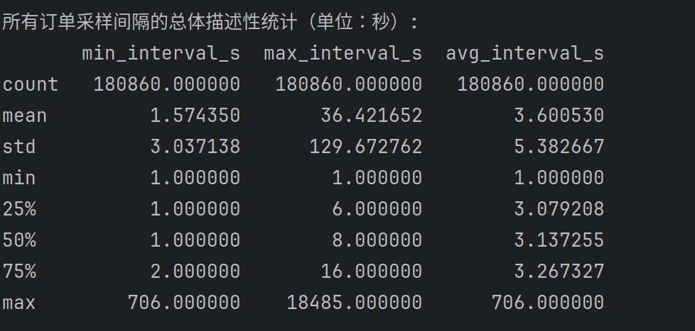

# map_matching

### 文件架构

- k_shortest_paths.py : 实现计算k条最短路径，并保存为csv文件
- roadnetwork_download.py : 实现下载openstreetmap的路网数据，保存为road_network_edges.csv和road_network_nodes.csv，并将路网可视化图像数据保存为road_network_map.png.
- data_vis.ipynb : 实现数据的随机采样，根据数量，订单，司机采样

### 匹配真值计算思路

根据每个订单为一次匹配，将未降采样的匹配结果作为真值

### 异常数据判定
根据单个订单的gps间隔判断，单个订单中gps间隔超过一定时间判定异常

### 任务
- 编写对订单gps数据降采样的代码
- 编写对订单gps添加高斯噪声的代码
- 观测订单异常数据分布

### Ai研究提示参考
https://aistudio.google.com/app/prompts?state=%7B%22ids%22%3A%5B%221qsHiuIUOVwMPOPaSZdgG0wyyfqmgKtO1%22%5D%2C%22action%22%3A%22open%22%2C%22userId%22%3A%22116399421483494854687%22%2C%22resourceKeys%22%3A%7B%7D%7D&usp=drive_link

### 统计

