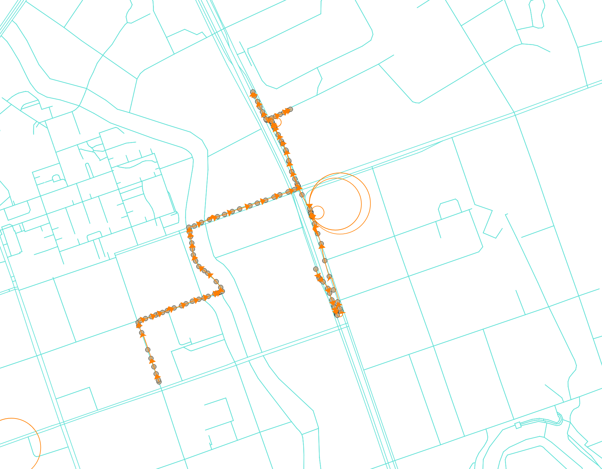
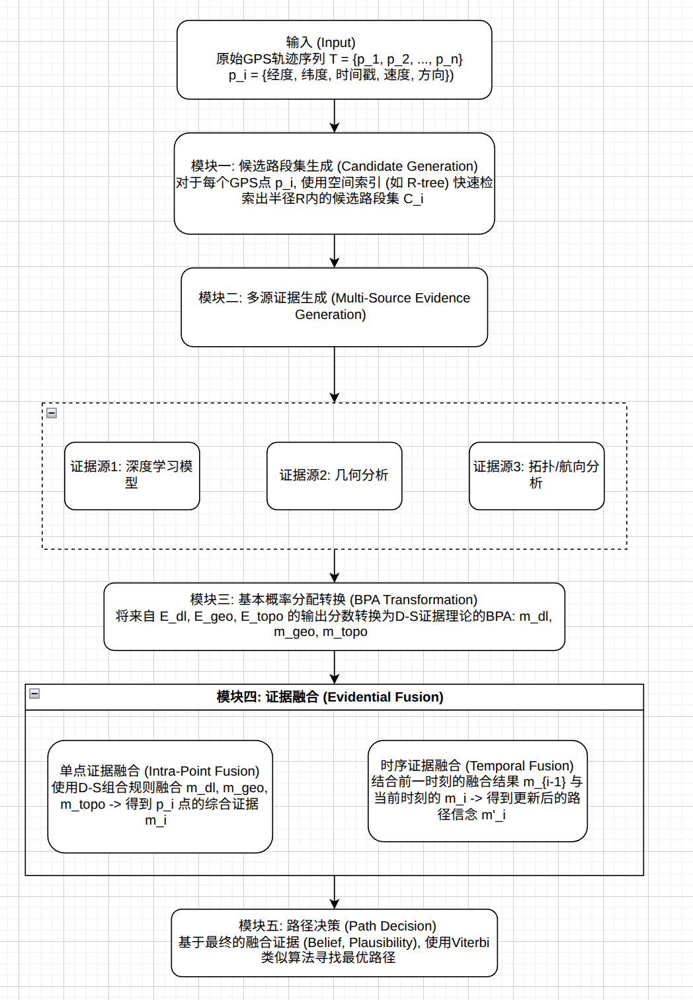

# map_matching

### 文件架构

- k_shortest_paths.py : 实现计算k条最短路径，并保存为csv文件
- roadnetwork_download.py : 实现下载openstreetmap的路网数据，保存为road_network_edges.csv和road_network_nodes.csv，并将路网可视化图像数据保存为road_network_map.png.
- data_vis.ipynb : 实现数据的随机采样，根据数量，订单，司机采样,订单中gps时间和距离差值分布图
- osrm_result_statics.ipynb: 观测开源map matching匹配结果，可视化误差直方图
- sample_abnormal_path.ipynb： 采样map matching异常订单
- osrm_map_matching.py： 给出过滤异常数据的gps序列，调用开源map matching算法，输出结果csv文件
- dete_abnormal_data.ipynb： 过滤原始gps数据中的异常数据，输出过滤后的csv文件
- downsample_addnoise.ipynb：给过滤后的数据添加噪声或降采样

### 匹配真值计算思路

弗雷歇距离（Frechet Distance）衡量的是“原始GPS轨迹”与“地图匹配后的轨迹”这两条路径在形状上的相似程度。
为什么弗雷歇距离比平均逐点误差更优越？

考虑以下两种情况：
情况A：匹配路径与原始路径平行且紧邻，但整体向右平移了10米。

情况B：匹配路径与原始路径在大部分地方重合，但在中间有一个点因为信号漂移而偏离了100米。

如果只看平均逐点误差：

在情况A中，平均误差大约是10米。

在情况B中，假设轨迹很长，一个100米的误差点被大量0误差的点平均后，最终的平均误差可能也只有10米左右。
显然，只看平均误差，我们无法区分这两种性质完全不同的错误。

但如果使用弗雷歇距离：
在情况A中，因为两条路径形状完全一样，只是平移了，所以弗雷歇距离就是10米（“狗绳”长度一直保持在10米）。
在情况B中，为了跨越那个100米的偏离点，“狗绳”必须至少被拉长到100米。因此，弗雷歇距离至少是100米。
通过弗雷歇距离，我们能够清晰地识别出情况B是一个更严重的“形状”错误。

### Seq2Seq
原本打算给模型输入定长gps序列和不定长的点的参考路段，然后输出参考路段的概率值，将最大的概率路段作为首选，如果无法联通，再从次概率选择

新思路：直接输入两个点之间的多条最短路径作为参考，输出路径的概率值，直接实现端到端的匹配

### 异常数据判定
- 订单中gps序列最大时间间隔必须小于 $\Delta t = 10 s$
- 订单中gps序列最大距离间隔必须小于 $\Delta D = 100 m$
- 订单中gps序列点集(移除重复点)必须大于 $n = 20$
- 订单中gps轨迹总长度必须大于 $L = 1000m$

### 问题
由于gps的噪声导致“序列回环”的问题

### 任务
- 获取真实标签和误差计算
- 观察匹配结果的误差数据分布，比如长短和点数之间的差异

### 开源地图匹配服务使用教程
1. 安装容器服务，详细参考https://github.com/jameskerry651/osrm-backend?tab=readme-ov-file
2. 在osrm_mapdata文件夹中启动容器服务docker run -t -i -p 5000:5000 -v "${PWD}:/data" ghcr.io/project-osrm/osrm-backend osrm-routed --algorithm mld /data/berlin-latest.osrm
3. 修改osrm_map_matching.py，调整文件输入路径参数后执行代码即可获得匹配结果

### 统计

### 研究框架

### **各模块详细设计**

#### **模块一: 候选路段集生成 (Candidate Generation)**

*   **目的**: 为每个GPS点高效地筛选出少量最可能相关的路段，减少后续计算量。
*   **输入**: 单个GPS点 `p_i`。
*   **技术**:
    *   构建路网的**R-tree**或**k-d tree**空间索引。
    *   以 `p_i` 为中心，设定一个搜索半径（例如50-100米），查询索引，返回所有落入该范围的路段作为候选集 `C_i`。
*   **输出**: 候选路段列表 `C_i = {r_1, r_2, ..., r_k}`。

#### **模块二: 多源证据生成 (Multi-Source Evidence Generation)**

此模块并行处理，为候选集 `C_i` 中的每个路段生成评分。

*   **2.1 证据源1: 深度学习模型 (E_dl)**
    *   **目的**: 从轨迹的局部时序动态中学习复杂的移动模式。
    *   **模型**: 预训练的**LSTM**或**GRU**网络。
    *   **输入**: 一个包含当前点 `p_i` 及其前后数个点的滑动窗口 `W_i = {p_{i-w}, ..., p_i, ..., p_{i+w}}` 的特征序列（坐标、速度、加速度等），以及候选路段集 `C_i` 的特征（几何、等级等）。
    *   **处理**: 模型分析输入序列与候选路段的匹配程度。
    *   **输出**: 一个概率分布向量，表示 `p_i` 属于 `C_i` 中每个候选路段的概率。例如 `[0.75, 0.15, 0.10]`。

*   **2.2 证据源2: 几何分析 (E_geo)**
    *   **目的**: 提供基础的、可靠的几何匹配信息。
    *   **输入**: GPS点 `p_i` 和候选路段集 `C_i`。
    *   **处理**: 计算 `p_i` 到每个候选路段 `r_j` 的投影距离 `d(p_i, r_j)`。使用高斯函数或指数函数将距离转化为相似度分数。距离越近，分数越高。
        *   `Score_geo(r_j) = exp(-d(p_i, r_j)^2 / (2 * sigma^2))`
    *   **输出**: 一个基于距离的几何分数向量。

*   **2.3 证据源3: 拓扑/航向分析 (E_topo)**
    *   **目的**: 利用路网的连通性和车辆的运动方向提供约束。
    *   **输入**: GPS点的航向 `h(p_i)`，候选路段 `r_j` 的走向，以及上一时刻的最优匹配路段 `r'_{i-1}`。
    *   **处理**:
        *   计算 `h(p_i)` 与 `r_j` 走向之间的角度差。差值越小，分数越高。
        *   检查 `r_j` 是否与 `r'_{i-1}` 在路网上连通。如果不连通（或需要非法转弯），则给予极低的分数。
    *   **输出**: 一个综合了航向和拓扑连通性的分数向量。

#### **模块三: 基本概率分配转换 (BPA Transformation)**

*   **目的**: 将各证据源输出的“分数”或“概率”，翻译成D-S理论能够处理的“基本概率分配 (BPA)”或“mass function (m)”。
*   **辨识框架 (Frame of Discernment)**: 对于每个GPS点 `p_i`，辨识框架 `Θ` 就是其候选路段集 `C_i`。
*   **转换规则**:
    *   对于**深度学习证据 (m_dl)**: 设 `P_dl(r_j)` 是模型输出的概率。可以设置一个折扣因子 `α` (0 < α < 1)，代表对DL模型的信任度。
        *   `m_dl({r_j}) = α * P_dl(r_j)`
        *   `m_dl(Θ) = 1 - α` (将剩余的信念分配给不确定性)
    *   对于**几何/拓扑证据 (m_geo, m_topo)**: 先将分数归一化，然后同样使用折扣因子 `β` 和 `γ` 进行转换。
        *   `Scores_norm(r_j) = Score(r_j) / sum(Scores)`
        *   `m_geo({r_j}) = β * Scores_norm(r_j)`
        *   `m_geo(Θ) = 1 - β`
*   **输出**: 针对 `p_i` 的一组BPA: `{m_dl, m_geo, m_topo}`。

#### **模块四: 证据融合 (Evidential Fusion)**

*   **4.1 单点证据融合 (Intra-Point Fusion)**
    *   **目的**: 对当前单个GPS点 `p_i`，融合来自所有源的证据，得到一个更鲁棒的综合判断。
    *   **技术**: 使用 **Dempster组合规则**。
    *   **处理**: `m_i = m_dl ⊕ m_geo ⊕ m_topo` (⊕ 代表D-S组合算子)。
    *   **输出**: `p_i` 的融合后BPA `m_i`。这个 `m_i` 不仅给出了对每个单一候选路段的信念，还可能给出了对“路段A或路段B”这种集合的信念。

*   **4.2 时序证据融合 (Temporal Fusion)**
    *   **目的**: 将当前点的判断与历史路径的判断结合起来，保证路径的连续性和平滑性。这类似于HMM中的转移概率，但用D-S理论实现。
    *   **技术**: D-S组合规则 + 状态转移。
    *   **处理**:
        1.  **预测/转移**: 将上一时刻 `t-1` 的融合信念 `m'_{i-1}`，根据路网拓扑关系，“传播”到当前时刻 `t` 的候选路段上。例如，如果 `m'_{i-1}` 对路段A有很高的信念，那么在 `t` 时刻，与A直接相连的候选路段会继承这个信念。这会生成一个先验信念 `m_{prior}`。
        2.  **更新/组合**: 使用D-S规则，融合这个先验信念 `m_{prior}` 和当前点的融合信念 `m_i`：`m'_i = m_{prior} ⊕ m_i`。
    *   **输出**: 考虑了历史信息的、更新后的BPA `m'_i`。

#### **模块五: 路径决策 (Path Decision)**

*   **目的**: 在处理完所有GPS点后，从所有可能的路径中，选出全局最优的一条。
*   **技术**: 类似于**Viterbi算法**的动态规划思想。
*   **处理**:
    1.  为每个点的每个候选路段计算一个“成本”或“得分”。这个得分可以基于最终的**信念函数 (Belief, Bel)** 或**似然函数 (Plausibility, Pl)**。Belief代表了支持该路段的最小证据量，更为保守；Plausibility代表了不与该路段冲突的最大证据量，更为开放。通常使用Belief。
    2.  构建一个格网（Trellis），其中每个时间步 `i` 包含候选路段 `C_i`。
    3.  使用动态规划，从头到尾寻找一条使得累计信念值（或对数信念值）最大化的路径。
*   **输出**: 最终匹配的路径序列 `{r'_1, r'_2, ..., r'_n}`。

### **实施和训练策略**

1.  **数据准备**: 需要大量带有高质量真值（Ground Truth）匹配路径的GPS轨迹数据。
2.  **模型训练 (离线)**: 单独训练模块二中的LSTM/GRU模型。输入是轨迹片段，标签是片段中每个点对应的正确路段。这是一个分类任务。
3.  **参数调优**: 框架中的超参数，如候选集搜索半径R，以及BPA转换中的折扣因子 `α, β, γ`，需要通过在验证集上测试来调优。这些因子反映了我们对不同证据源的先验信任程度。
4.  **集成与评估**: 将所有模块组合起来，在测试集上评估端到端的地图匹配性能（如准确率、召回率）。

通过这个框架，你可以系统地结合深度学习的模式识别能力和D-S证据理论在不确定性推理上的优势，创建一个在复杂环境下（如城市峡谷、交叉口）表现优异的创新地图匹配算法。